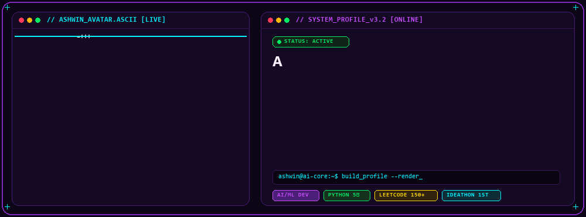

<div align="center">
  <!-- 🔮 Cyberpunk Animated ASCII Portrait & Engineering HUD -->
  

  <br/><br/>

  <!-- ⚡ Dynamic Typing Header -->
  

  <br/><br/>

  <!-- 🏆 Modern Animated Achievements HUD -->
  
</div>

<br/>

## 🧠 About Me

```yaml
Name: Ashwin Kumar L
Education: B.E. in Computer Science & Engineering (Sri Ramakrishna Engineering College, Coimbatore)
Specialization: Artificial Intelligence, Machine Learning & Intelligent Software Engineering
Problem Solving: 150+ LeetCode algorithms solved • HackerRank Gold Badge in Python
Current Focus: Computer Vision, Large Language Models & Deep Learning Pipelines
Interests: Autonomous Systems, Competitive Programming, Game Strategy & Automation
```

---

## ⚡ Tech Stack & Tooling

<div align="center">
  <!-- Interactive & Animated Skill Icons -->
  <a href="https://skillicons.dev">
    
  </a>
</div>

<br/>

<div align="center">
  
  
  
  
  
</div>

---

## 📊 Live GitHub Analytics

<div align="center">
  
  &nbsp;
  
</div>

<br/>

<div align="center">
  
</div>

---

## 🏆 GitHub Trophies & Milestones

<div align="center">
  
</div>

---

## 🧱 Contribution Matrix

<div align="center">
  
</div>

> ⚡ *Real-time contribution snake is synchronized daily via GitHub Actions.*

---

## 🌐 Connect & Network

<div align="center">
  <a href="https://github.com/AshwinKumarL">
    
  </a>
  &nbsp;
  <a href="https://leetcode.com/u/AshwinKumarL/">
    
  </a>
  &nbsp;
  <a href="mailto:ashwin.kumar.cse@example.com">
    
  </a>
  &nbsp;
  <a href="https://linkedin.com">
    
  </a>
</div>

<br/>

<div align="center">
  
</div>
