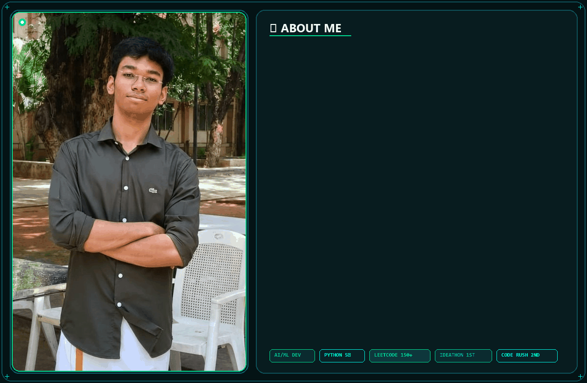
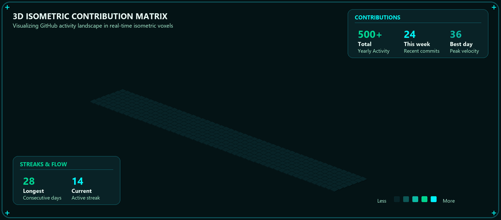

  <!-- 🔮 Profile Banner: New Photo + Smooth Sliding About Me -->
  

    

  <!-- ⚡ Dynamic Typing Header in Emerald / Cool Teal -->
  

    

  <!-- 🏆 Modern Animated Achievements HUD in Emerald & Cool Teal -->
  

 

## ⚡ Tech Stack & Tooling

  <!-- Core Skill Icons (Python, C, Java, Git, GitHub, VS Code) -->
  

 

  
  
  
  
  
  
  

---

## 📊 Live GitHub Analytics

  
  &nbsp;
  

 

  

---

## 🏆 GitHub Trophies & Milestones

  

---

## 🧱 3D Contribution Matrix

  

> ⚡ *Real-time 3D isometric contribution skyline synchronized with GitHub activity.*

---

## 🌐 Connect & Network

  
  &nbsp;
  
  &nbsp;
  
  &nbsp;
  

 

  

