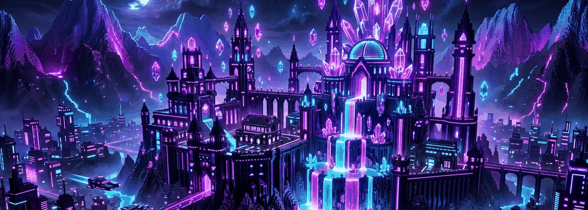
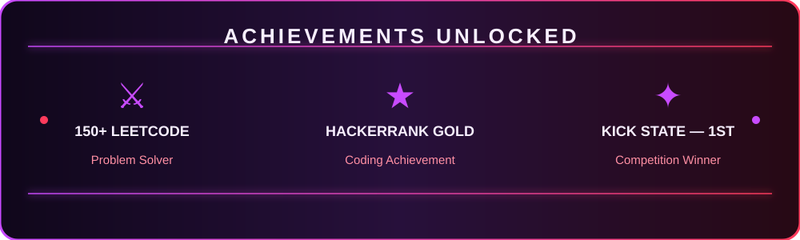

<div align="center">
  

  

  
</div>

## 🧠 About me

```text
🎓 B.E. Computer Science and Engineering — Sri Ramakrishna Engineering College, Coimbatore
💻 Python • Artificial Intelligence • Machine Learning • Software Development
🧩 150+ LeetCode problems solved
🚀 Building AI, computer vision, and document-processing projects
🎮 Gamer interested in strategy, automation, and problem-solving
```

## ⚡ Tech stack

<p align="center">
  
  
  
  
  
</p>

## 📊 Live GitHub stats

<p align="center">
  
  
</p>

<p align="center">
  
</p>

## 🧱 Contribution world

<p align="center">
  
</p>

> The contribution animation is generated daily from the public contribution graph. Run the included workflow once after pushing this repository to create the first animation.

## 🏆 Trophies and activity

<p align="center">
  
</p>

<p align="center">
  
</p>

<p align="center">
  
</p>

<!-- Built for AshwinKumarL. Local project assets use relative paths; the contribution animation is published by GitHub Actions to the output branch. -->
